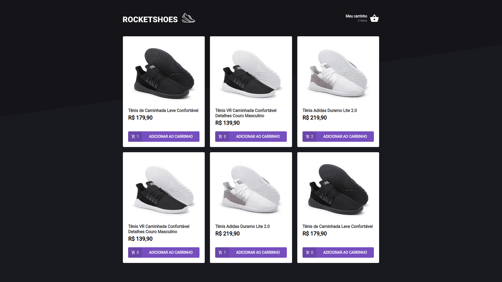
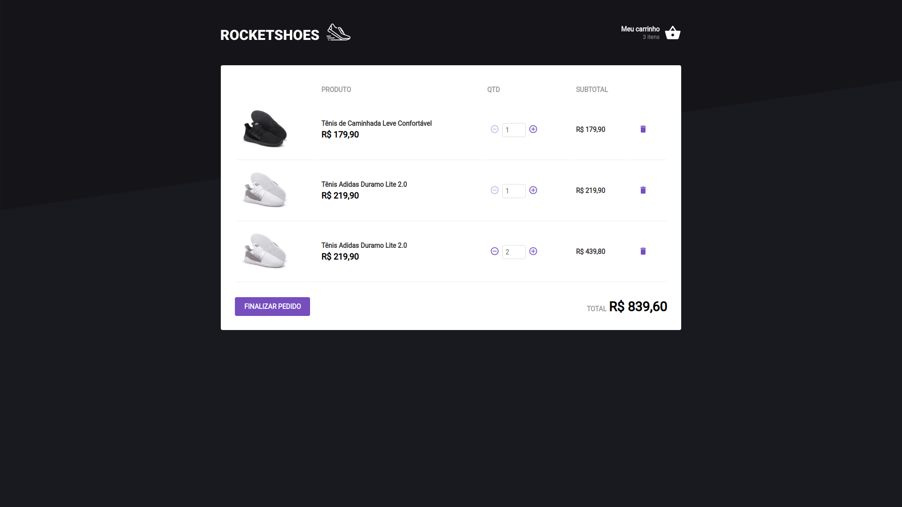
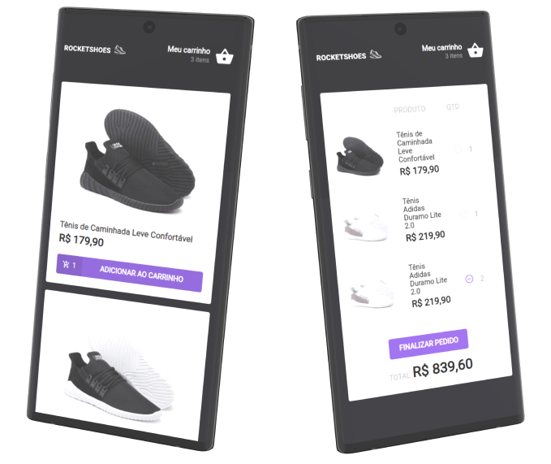

<p align="center">
    
</p>

<h2 align="center">
    The cool shoes e-commerce
</h2>

## Layout

**Home**


**Cart**


**Mobile**
<p align="center">
    
</p>

## Usage
You'll need [Node.js](https://nodejs.org/en/) to run this project. First clone the repository, move into the project's directory and install the dependencies.
```
$ git clone https://github.com/Eduardo-H/Rocketshoes-Challenge
$ cd Rocketshoes-Challenge
$ yarn install
```

This projects uses [JSON Server](https://github.com/typicode/json-server) to fake API calls. You'll need to start the fake API firts to then run the application. Open a bash window an run this command:
```
$ yarn server
```

And then, on another bash window, run the following command:
```
$ yarn start
```

## Technologies
- Typescript
- React
- JSON Server